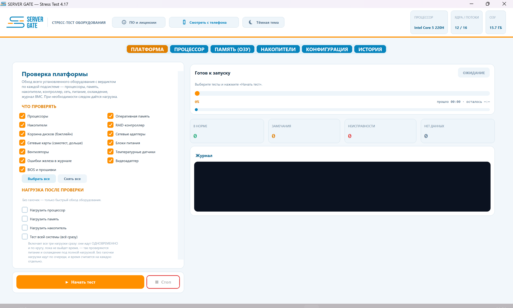
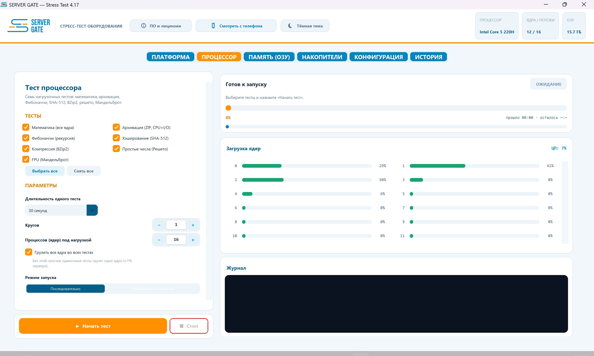
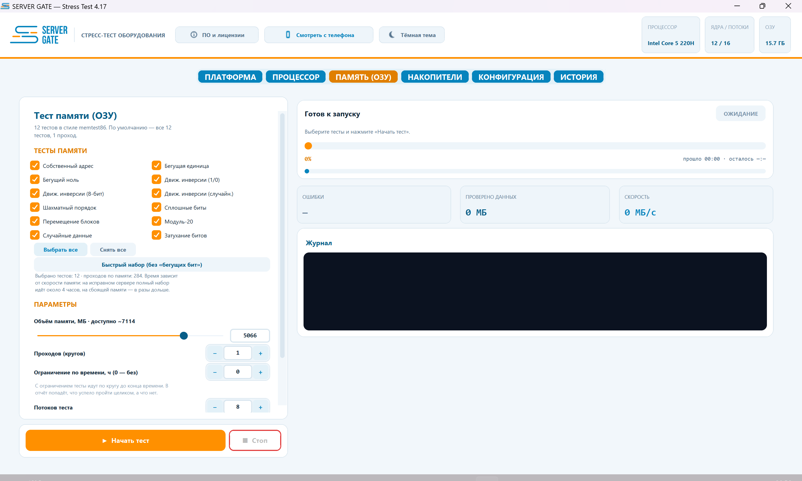
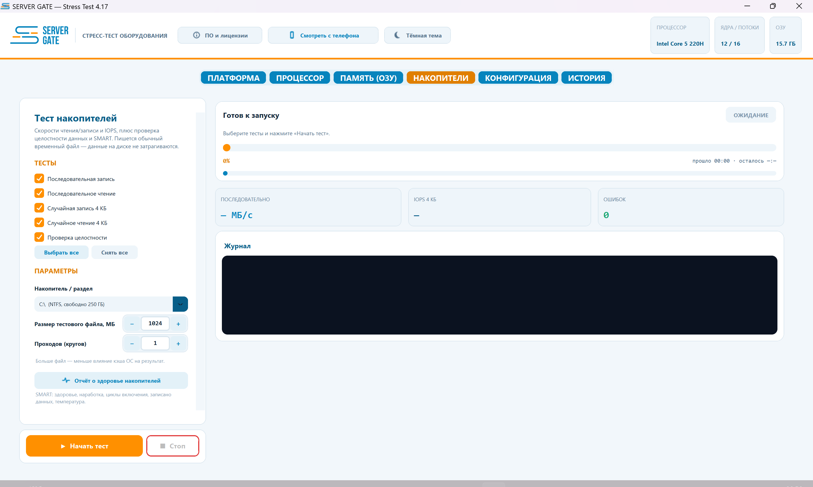
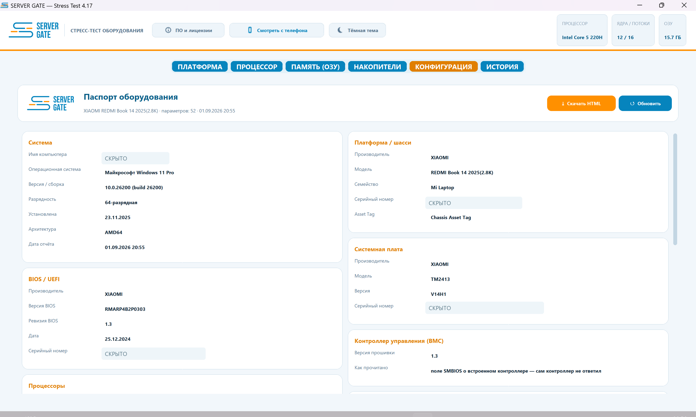
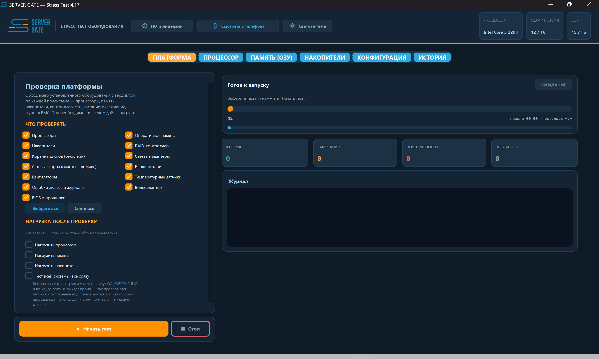
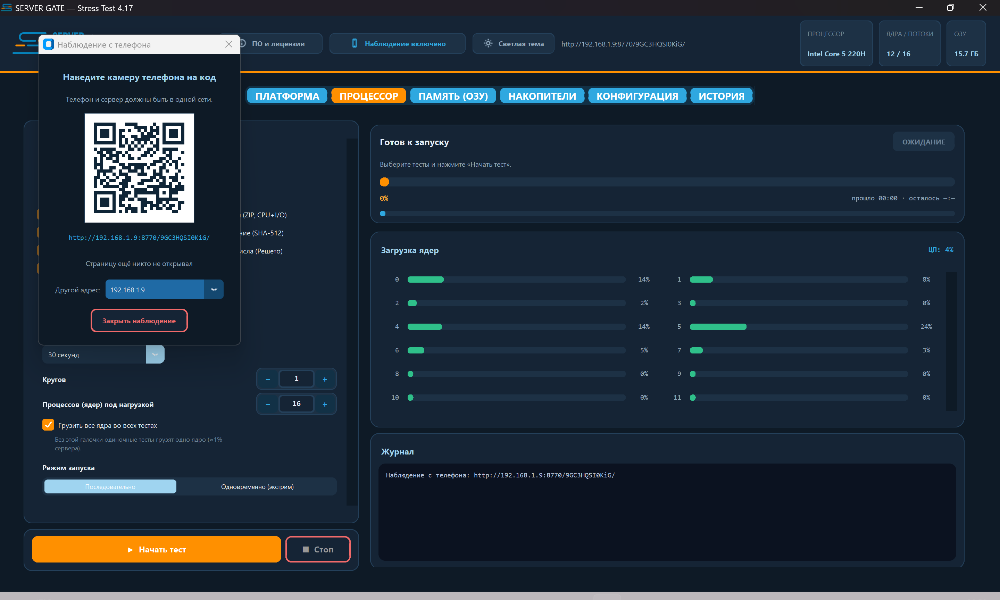
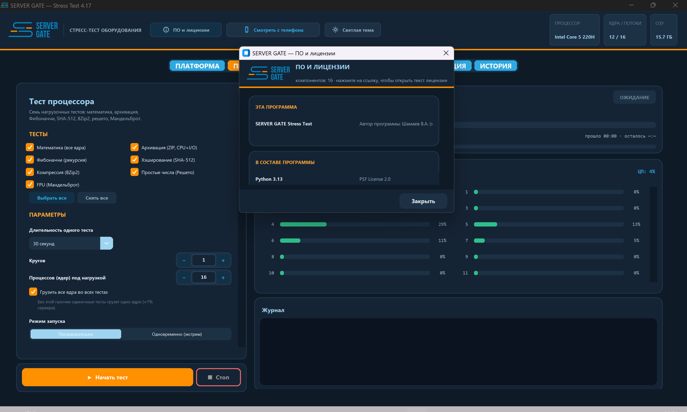

# SERVER GATE Stress Test

Профессиональная платформа для автономной диагностики, стресс-тестирования и подготовки серверного оборудования.

> Проект находится на этапе внутреннего тестирования. Этот репозиторий носит исключительно ознакомительный характер и не содержит исходного кода, установочных образов или файлов для скачивания.

## О продукте

SERVER GATE Stress Test запускается непосредственно на проверяемом оборудовании и объединяет инвентаризацию, диагностику и длительное нагрузочное тестирование сервера в одном интерфейсе. Платформа предназначена для технических специалистов, сервисных центров и отделов подготовки серверного оборудования.

## Основные возможности

- автоматическое определение конфигурации сервера;
- отдельный контроль температуры каждого установленного процессора;
- стресс-тестирование CPU, оперативной памяти и накопителей;
- проверка RAID-контроллеров, батарей и дисковых корзин;
- диагностика сетевых адаптеров с корректной обработкой неподключённых портов;
- мониторинг вентиляторов, блоков питания, напряжений и температурных зон;
- длительный циклический прожиг оборудования;
- аппаратный BMC Watchdog для контроля зависаний во время ночных тестов;
- отображение процесса тестирования на телефоне в локальной сети;
- автономные HTML-отчёты с конфигурацией, результатами и тепловой картой;
- безопасное стирание накопителей с формированием сертификата;
- светлая и тёмная темы интерфейса;
- загрузка непосредственно на физическом сервере без установленной ОС.

## Принцип работы

1. Специалист загружает сервер в автономную среду SERVER GATE.
2. Платформа определяет установленное оборудование и доступные датчики.
3. Оператор выбирает необходимые тесты или запускает комплексную проверку.
4. Во время тестирования отображаются температура, нагрузка, состояние оборудования и найденные отклонения.
5. По завершении формируется автономный HTML-отчёт для просмотра, печати или передачи заказчику.

## Интерфейс

Визуальная часть продукта разработана для работы непосредственно в серверной: крупные состояния, понятная цветовая индикация и минимум действий для запуска проверки.

### Комплексная проверка платформы

### Тестирование процессоров и оперативной памяти

| Процессор | Оперативная память |
|---|---|
|  |  |

### Накопители и паспорт оборудования

| Накопители | Конфигурация |
|---|---|
|  |  |

Серийные номера и идентификаторы оборудования на публичных материалах скрыты.

### Тёмная тема

### Наблюдение с телефона

Оператор может открыть локальную страницу состояния по QR-коду и следить за ходом проверки с телефона в той же сети.

### Сведения о компонентах и лицензиях

Информация об используемых компонентах и их лицензиях доступна непосредственно из интерфейса программы.

## Поддерживаемые направления диагностики

| Подсистема | Возможности |
|---|---|
| Процессоры | Нагрузка, ошибки вычислений, температура по каждому CPU |
| Память | Нагрузочные тесты, ECC и сведения о модулях DIMM |
| Накопители | SMART/NVMe, поверхность, температура и состояние |
| RAID | Модель контроллера, состояние массивов и батареи |
| Сеть | Инвентаризация, аппаратный self-test и проверка линка |
| Охлаждение | Вентиляторы, температурные зоны и тепловая карта |
| Питание | Блоки питания и доступные датчики напряжения |
| Платформа | BIOS, BMC, системная плата и общая конфигурация |

## Отчётность

Отчёты формируются локально и не требуют подключения к внешнему сервису. Документ объединяет паспорт оборудования, результаты тестов, выявленные предупреждения, температурные показатели и итоговый вердикт.

## Конфиденциальность

Диагностика выполняется локально на проверяемом сервере. Для основной работы платформы не требуется передача данных в облачные сервисы.

## Статус проекта

Текущая версия проходит внутреннее тестирование в техническом отделе. Возможности и внешний вид продукта могут изменяться по результатам эксплуатации на разных серверных платформах.

## Доступность

SERVER GATE Stress Test не распространяется через этот репозиторий. Исходный код, загрузочные образы и исполняемые файлы здесь не публикуются.

## Правовая информация

SERVER GATE и связанные графические материалы являются собственностью правообладателя. Названия сторонних производителей и продуктов принадлежат их владельцам и используются исключительно для обозначения совместимости.

© 2026 SERVER GATE. Все права защищены.
